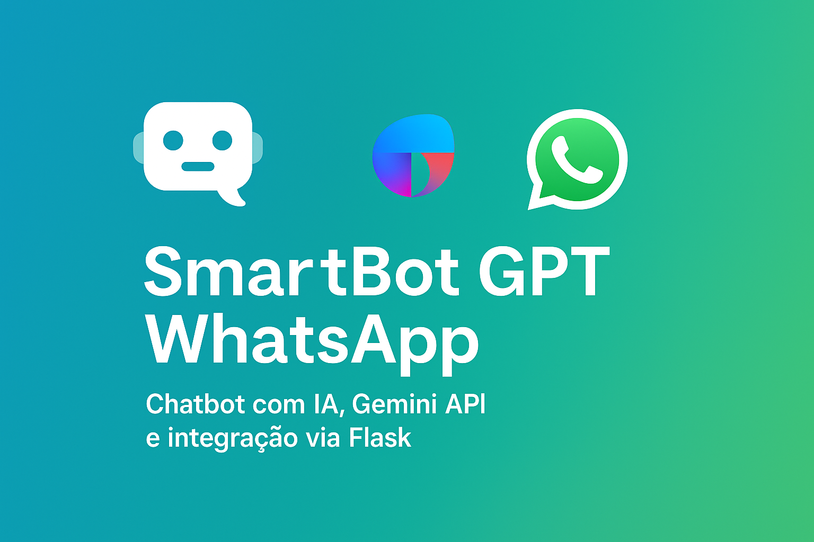

# 🤖 SmartBot GPT WhatsApp (com Gemini API)

Este projeto é um chatbot inteligente baseado em IA, integrado ao WhatsApp (simulado via API Flask), que responde perguntas de forma contextual usando o modelo **Gemini 1.5 Flash** da Google AI.

---

## 📚 Sumário

- [💡 Funcionalidades](#-funcionalidades)
- [💬 Exemplo de uso](#-exemplo-de-uso)
- [📂 Estrutura do Projeto](#-estrutura-do-projeto)
- [🛠️ Tecnologias Usadas](#️-tecnologias-usadas)
- [🚀 Como executar localmente](#-como-executar-localmente)
- [📈 Próximas melhorias](#-próximas-melhorias)
- [✍️ Autor](#autor)
- [📝 Licença](#-licença)

---

## 💡 Funcionalidades

- ✅ Integração com a API Gemini (Google AI)  
- ✅ Requisições via Webhook com Flask  
- ✅ Respostas inteligentes com base em contexto  
- ✅ Usa informações de um arquivo `.txt` como fonte (ex: planos de assinatura)  
- ✅ Pronto para conectar com WhatsApp Business API ou Twilio  
- ✅ Projeto ideal para estudo, demonstração e portfólio  

---

## ✨ Funcionalidades extras

- ✅ **Destaque visual no terminal** com palavras-chave inteligentes como "Tema", "Setor", "Tecnologia" para facilitar a leitura da resposta da IA.

---

## 💬 Exemplo de uso

> **Usuário no WhatsApp:**  
> "Quais são os planos disponíveis?"

> **Resposta do bot:**  
> "Temos três planos: Básico (R$29), Premium (R$59) e Profissional (R$99). Todos aceitam Pix, cartão e boleto."

---

## 📂 Estrutura do Projeto

```
smartbot-gpt-whatsapp/
├── app.py
├── .env
├── README.md
└── data/
    └── infos_produto.txt
```

---

## 🛠️ Tecnologias Usadas

- Python 3  
- Flask  
- Google Generative AI (Gemini)  
- Twilio (opcional para integração real com WhatsApp)  
- `.env` para configuração segura da chave de API  

---

## 🚀 Como executar localmente

1. **Clone o repositório:**

```bash
git clone https://github.com/MrsM21/smartbot-gpt-whatsapp.git
cd smartbot-gpt-whatsapp
```

2. **Instale as dependências:**

```bash
pip install flask python-dotenv google-generativeai
```

3. **Crie o arquivo `.env` com sua chave da Gemini API:**

```
GOOGLE_API_KEY=sua-chave-aqui
```

4. **Adicione as informações do produto em:**

```
data/infos_produto.txt
```

5. **Execute o aplicativo:**

```bash
python app.py
```

---

## 📈 Próximas melhorias

- [ ] Integração com PDFs usando LangChain  
- [ ] Armazenamento de contatos (mini CRM)  
- [ ] Versão com deploy gratuito (Replit, Render ou Railway)  
- [ ] Interface web visual (Gradio ou Streamlit)  

---

## Autor

✍️ Projeto criado por [NeusaM21](https://github.com/NeusaM21) para fins educacionais...


---

## 📝 Licença

Este projeto está licenciado sob a [MIT License](./LICENSE). Use, adapte e compartilhe com créditos. 😉


